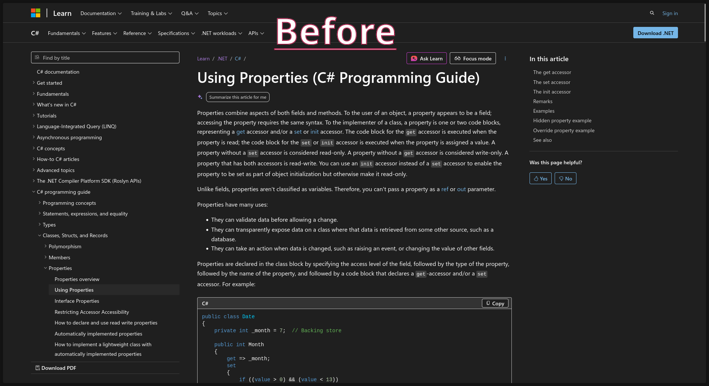
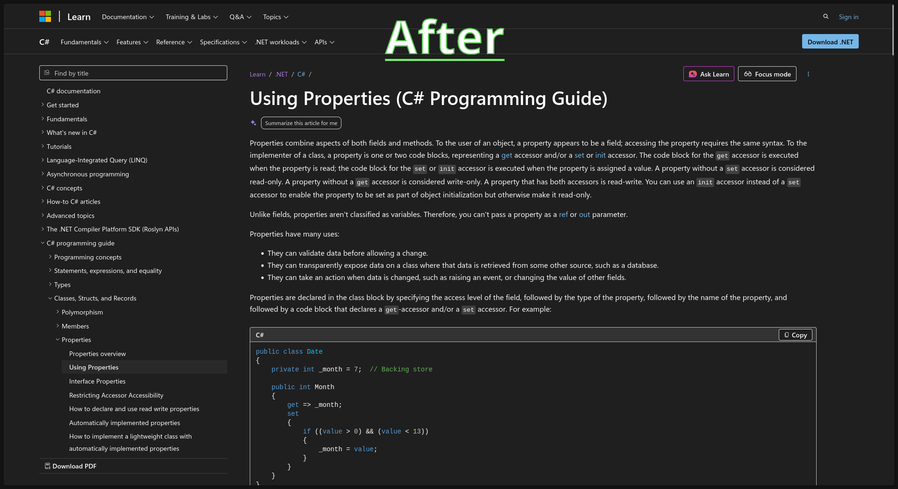

## Refined Microsoft Learn

> [!NOTE]
> This project is a fork and will not be supported, it is designed just for me.

Make Microsoft Learn better by focusing on the main content.

This repository is a fork of [merill/refined-microsoft-learn](https://github.com/merill/refined-microsoft-learn). It targets only to Firefox and includes upkeep and configuration changes from the original project.

This extension gives you a cleaner, faster and more readable Microsoft Learn experience without the clutter.

- Removes the content on the right pane
- Expands the main content area so code samples and tables have more horizontal space

  
  &nbsp;
  

